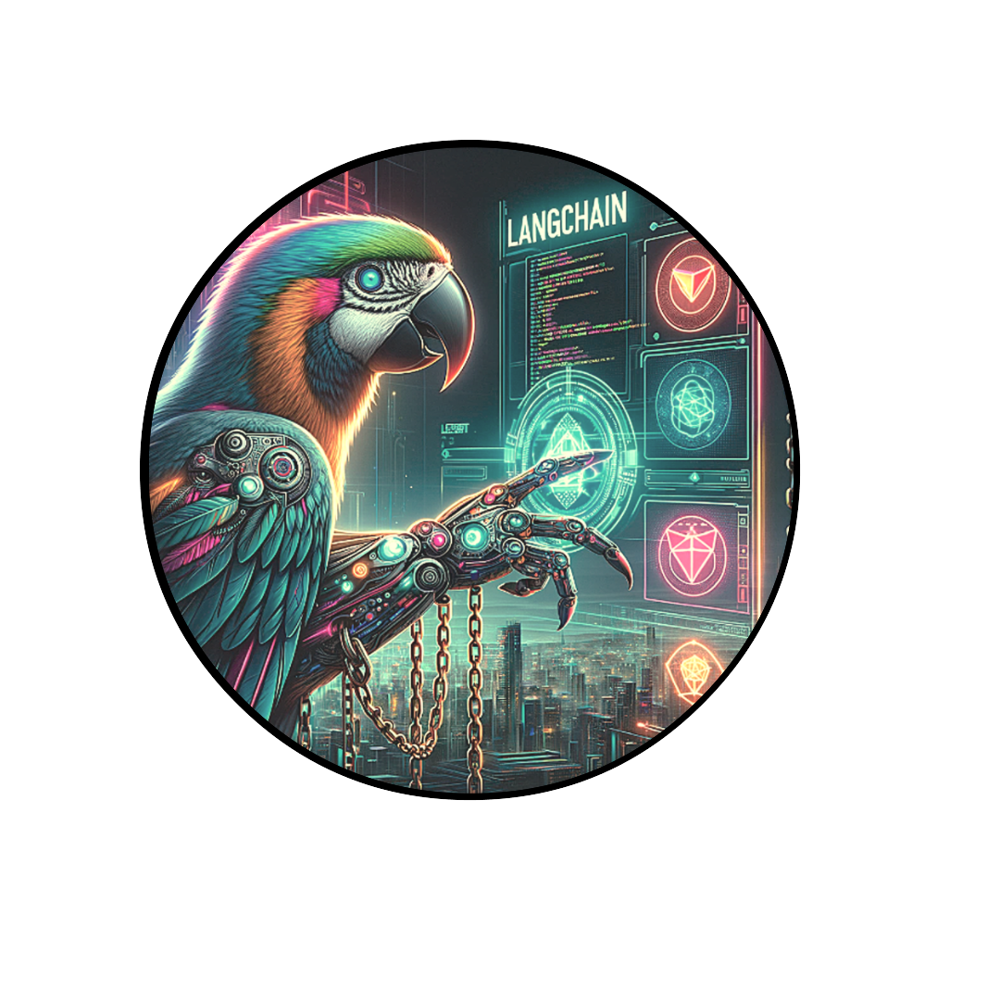

# 🦜🔗 LangChain - Comprehensive Guide

## Overview

LangChain utilizes OpenAI's API for developing NLP applications. It provides a modular architecture that streamlines the integration of pre-trained language models and data storage systems. This facilitates the creation of chatbots and automated writing assistants.

For detailed information, visit: [LangChain Introduction](https://python.langchain.com/docs/get_started/introduction).



## Workflow in LangChain

1. **Data Acquisition**: Gather various types of data.
2. **Data Processing**: Includes vectorization, model development, training, testing, and deployment.
3. **Machine Learning Application**: Use machine learning for dataset queries.
4. **Model Interaction**: Submit queries for responses.
5. **Receive and Utilize Outputs**: Use the outputs received from the model.

## Setup

### Python Configuration

#### Environment Setup

```bash
# Set up project environment
cd your_project_directory
echo "OPENAI_API_KEY=YOUR_API_KEY_HERE" > .env
source .env
echo "OPENAI_API_KEY=${OPENAI_API_KEY:0:5}..."
```

##### API Key: [Your API Key](https://platform.openai.com/account/api-keys)

#### Conda Environment

```bash
# Create and activate a Conda environment
conda create --name langchain_env python=3.11
conda activate langchain_env

# Install dependencies
pip install -r requirements.txt
```

#### Script Execution

```bash
# Run OpenAI and LangChain scripts
python3 src/my_openai.py
python3 src/llm_example.py
```

#### Simplified Single Command Execution

```bash
cd your_project_directory && \
echo "OPENAI_API_KEY=YOUR_API_KEY_HERE" > .env && \
source .env && \
conda create --name langchain_env python=3.11 && \
conda activate langchain_env && \
pip install -r requirements.txt && \
python3 src/my_openai.py && \
python3 src/llm_example.py
```

### Troubleshooting Tips

- Confirm `.env` file placement in project root.
- Verify Python version in Conda environment.
- For package installation issues, review `requirements.txt`.
- Address OpenAI library issues with `openai migrate`.

For comprehensive troubleshooting, refer to the OpenAI Python library [README](https://github.com/openai/openai-python) and [migration guide](https://github.com/openai/openai-python/discussions/742).


## LangChain Application Development

### Building Language Model Applications

```python
# Language model application example
from langchain.llms import OpenAI

llm = OpenAI(model_name="text-ada-001", n=2, best_of=2)

# Generate content
llm("Tell me a joke")
llm_result = llm.generate(["Tell me a joke", "Tell me a poem"]*15)

# Display outputs
len(llm_result.generations)
llm_result.generations[0]
```

### Running Language Model Applications

```bash
# Execute the language model application script
python3 openai_llm.py
```

### Advanced Usage: Modular Abstraction and Chains

```python
# Modular abstraction using chains
from langchain.prompts import PromptTemplate
from langchain.llms import OpenAI
from langchain.chains import LLMChain

# Initialize OpenAI and PromptTemplate
llm = OpenAI(temperature=0

## Acknowledgements

LangChain draws inspiration from [Hugging Face](https://huggingface.co/), [OpenAI](https://openai.com/), and [GPT-3](https://openai.com/blog/gpt-3-apps/). It utilizes OpenAI's [API](https://beta.openai.com/docs/api-reference/introduction) for text generation.